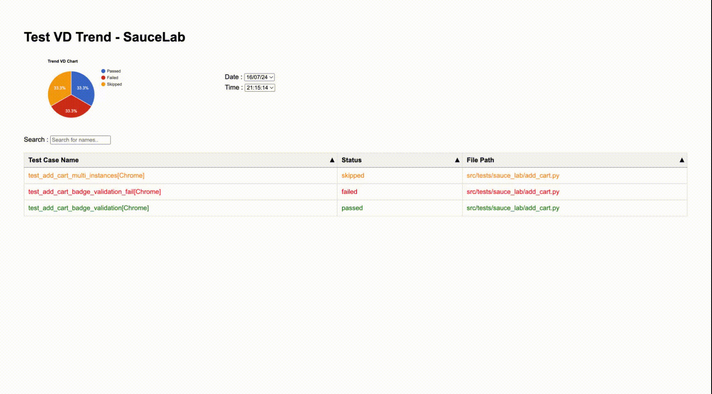

# AutoVD-Python-Playwright

AutoVD-Python-Playwright is a Python-based automation framework designed for web and API testing. It leverages Playwright for browser automation and provides a structured approach to creating page objects and test cases.

## Table of Contents

- [Installation](#installation)
- [Usage](#usage)
  - [Creating a Page Class](#creating-a-page-class)
  - [Writing a Test Case](#writing-a-test-case)
- [Configuration](#configuration)
- [Running Tests](#running-tests)
- [VD Report](#vd-report)
- [License](#license)

## Installation

To use AutoVD-Python-Playwright, clone the repository and install the required dependencies:

```bash
git clone https://github.com/KMD-Vignesh/AutoVD-Python-Playwright.git
cd AutoVD-Python-Playwright
pip install -r requirements.txt
playwright install
```

## Usage

### Creating a Page Class

To create a page class, define a class that inherits from `PageVD` and initialize it with a `PlayVD` instance. Use string selectors for web elements.

```python
from dataclasses import dataclass
from typing import Self

from library.helper.vd_play import PlayVD
from library.interface.vd_page import PageVD

@dataclass
class LoginPage(PageVD):
    def __init__(self, playVD: PlayVD) -> None:
        super().__init__(playVD=playVD)

    username_input: str = "#user-name"
    password_input: str = "#password"
    login_button: str = "#login-button"

    def login_to_app(self, username: str, password: str) -> Self:
        self.playVD.type(selector=self.username_input, fill_text=username)
        self.playVD.type(selector=self.password_input, fill_text=password)
        self.playVD.click(selector=self.login_button)
        self.playVD.log(message="Action : Logged into Application")
        return self
```

### Writing a Test Case

To write a test case, use the `pytest` framework and import your page classes. Initialize the page class with a `PlayVD` instance and define your test logic.

```python
import pytest
from library.helper.vd_play import PlayVD
from pages.sauce_lab.main_page import MainPage

from library.model.vd_config import ConfigVD

@pytest.mark.vignesh
@pytest.mark.add_cart
def test_add_cart_badge_validation(playVD: PlayVD) -> None:
    main_page = MainPage(playVD=playVD)
    main_page.open_app(url=ConfigVD.URL.get(key="SauceLab")).login_to_app(
        username=ConfigVD.Credentials.get(key="UserName"),
        password=ConfigVD.Credentials.get(key="Password"),
    ).assert_true(condition=main_page.is_main_page_loaded()).add_cart_product(
        product_name="Sauce Labs Bike Light"
    ).assert_true(condition=main_page.get_product_count_badge() == 1).add_cart_product(
        product_name="Sauce Labs Backpack"
    ).assert_true(condition=main_page.get_product_count_badge() == 2).add_cart_product(
        product_name="Sauce Labs Onesie"
    ).assert_true(condition=main_page.get_product_count_badge() == 3)
```

## Configuration

Configurations such as URLs and credentials are managed through the `vd_config.yml` file (located at `setting/config/vd_config.yml`). Ensure you have a configuration file with the necessary settings.

```yaml
Project:
  ProjectName : SauceLab

Pytest:
  IsDryRun : false
  IsFailureRerun : false
  ParallelCount : 3
  IsParallelGroupFile : false
  DeleteConftest : true
  Tag : add_cart

Browser:
  IsHeadless : false
  DefaultBrowser : chromium
  IsMultiBrowser : false
  DeleteDownloads : true
  MultiBrowserList : 
    - chromium
    - firefox
    - webkit

Allure:
  Generate : true
  AutoOpenServer : false

URL:
  SauceLab : https://saucedemo.com
  SelDev : https://www.selenium.dev/downloads/

Credentials:
  UserName : standard_user
  Password : secret_sauce
```

## Running Tests

To run your tests, use the `pytest` command:

```bash
python runner.py
```

## VD Report

The framework generates two types of reports:

1. **Current Execution Report**: A detailed report of the most recent test execution.
2. **Trend Report**: A report showing trends over time, allowing you to filter results by date and time for detailed analysis.



## License

This project is licensed under the MIT License. See the [LICENSE](LICENSE) file for details.
